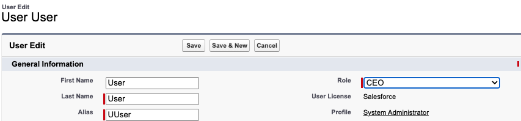
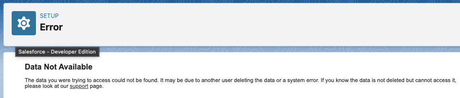

# Broken Roles

> In Scratch Orgs without sample data (`"hasSampleData": true`), the existing UserRoles (`CEO`, ...) are broken and cannot be assigned to a user.

In the UI, this looks like this:




When running Apex

```
UserRole role = [SELECT Id, Name FROM UserRole WHERE Name = 'CEO' LIMIT 1];
update new User(Id = UserInfo.getUserId(), UserRoleId = role.Id);
```

you'll get the following error:

```
System.DmlException: Update failed. First exception on row 0 with id 0055t000003Ic5wAAC; first error: INVALID_CROSS_REFERENCE_KEY, invalid cross reference id: []
```

[](https://github.com/mdapi-issues/scratch-org-bug-roles-are-broken/actions)

> [!IMPORTANT]
> A green status badge means the issue was successfully reproduced.
>
> A red status badge means the issue was fixed or the pipeline failed for another reason.

## References

- https://salesforce.stackexchange.com/questions/257286/sfdx-setting-role-for-user-user

## Workarounds

- Deploy new Roles via Metadata
- Recreate existing Roles
- use `"hasSampleData": true`
